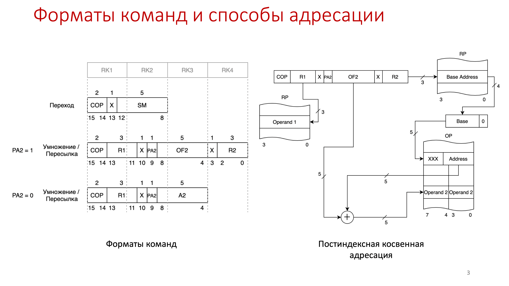

# Проектирование процессор ЭВМ

## 1 слайд

Добрый день! Я, студент группы Б17-503, Яковенко Иван, представляю вам курсовой проект на тему "Проектирование процессора ЭВМ"

## 2 слайд

Работа ведется с четырехразрядными числами в дополнительном коде со знаком.

Спроектированный процессор выполняет 4 операции:

- УМНОЖЕНИЕ чисел со знаком с младших разрядов
- ПЕРЕСЫЛКУ ОТРИЦАТЕЛЬНУЮ – то есть взятие отрицательного значения модуля числа. Так же устанавливается признак результата равный знаку результата (1 если число меньше нуля, 0 если число равно нулю)

И два перехода:

- Условный переход, если признак результата равен 1
- Безусловный переход

## 3 слайд

Для размещения команд в памяти были разработаны представленные форматы. Первый операнд команды УМНОЖЕНИЕ и ПЕРЕСЫЛКА ОТРИЦАТЕЛЬНАЯ задается при помощи прямой регистровой адресации. Второй операнд, в зависимости от признака адресации PA2, указывается либо с помощью прямой адресации, либо с помощью постиндексной косвенной. Для команд перехода используется относительная адресация и соответственно смещение со знаком, которое указывается в команде. Схема постиндексной косвенной адресации показана справа на слайде. Для формирования исполнительного адреса выполняется последовательное считывание из РП, ОП и сложение со смещением из команды.

## 4 слайд

Для адресации в БМК был выбран принудительный способ указания следующего адреса. Следующий адрес при отсутствии ветвления равен адресу указанному в команде. Если же необходимо ветвление переход осуществляется по А+1. Логическая схема проверки маски признаков представлена слева на слайде.
В случае ветвления, адрес перехода всегда должен быть четным.

## 5 слайд

Далее перейдем непосредственно к алгоритму выполнения команд. Ранее я рассказывал про ветвление на два направляения, однако на данном слайде придутсвует ветвление на три направления. Для этого была введена пустая команда (без управляющих сигналов). По умолчанию в алгоритме сперва читаются два слова из оперативной памяти, далее идет определения типа команды – линейная / нелинейная. В случае линейной команды читаются одно или два слова перед записью операндов в буферные регистры. Количество определяется способом адресации. Запись результата так же в зависимости от способа адресации производится в РП или ОП.

## 6 слайд

На схеме представлена функциональная схема блока управления командами. Для формирования исполнительного адреса при использовании постиндексной косвенной адресации был введен регистр исполнительного адреса RIA. В него последовательно записывается адрес из регистровой памяти, расширенный нулем, базовый адрес из оперативной памяти и наконец сумма базы и смещения для обращения к оперативной памяти по исполнительному адресу.
Два операнда, считанные из РП и ОП, поступают в буферные регистры BR1 и BR2, а далее в АЛУ.

## 7 слайд

Считанные операнды из памяти поступают в АЛУ, где обрабатываются в блоке операций. На функциональной схеме видно, что две операции (умножение и пересылка) были объединены с помощью КС1 которая выбирает операнд на вход сумматора. КС2 предварительно инвертирует операнд при заданном Y5. Так как работа идет в дополнительном коде, при инвертировании необходимо прибавлять 1. Это происходит автоматически с подачей Y5 на CI сумматора. Знак результата при второй операции сохраняется в TPR.

## 8 слайд

На слайде показан пример работы АЛУ на функциональном моделировании. Операнд A = 1.010 или -6/8, операнд B = 0.110 или 6/8. При перемножении ожидаемый результат должен быть -36/64 или при обрезке до 4 битов -5/8 то есть 1.011. Этапы вычисления проиллюстрированы с помощью примера вычисленного вручную. Для проверки старта МУУ не с нулевого состояния тест был запущен дважды.
В процессе тестирования было выяснено, что минимальное число тактов достигается при операнде B = 0. Максимальное число тактов при B = 5.

## 9 слайд

Для отладки процессора было проведено его тестирование. Данный тест обеспечивает:

- Проверку всех микрокоманд алгоритма (проход по всем веткам алгоритма)
- Проверку считывания команд разного формата, расположенных по четным и нечетным адресам в оперативной памяти (напр., первое умножение и пересылка)
- Проверку считывания операндов из оперативной памяти, расположенных по четным и нечетным адресам (D и F)
- Проверку записи результата в оперативную память по четным и нечетным адресам (D и F, в операциях пересылки)
- Проверку считывания операндов из регистровой памяти (C/K)
- Проверку записи операндов в регистровую память (K)
- Проверку всех используемых способов адресации (все)
- Проверку правильности вычисления признака перехода (есть или нет переход на А16)
- Проверку правильности работы АЛУ (значения совпадают с рассчитанными вручную)

Размещение команды в памяти представлено на рисунке справа.
Значения, вырабатываемые процессором полностью совпадают со значениями, рассчитанными вручную.
Соответственно на рассчитанном примере показан ход выполнения программы. Изогнутыми стрелками показана связь между записанными и считанными значениями. Изображен процесс вычисления исполнительного адреса для операндов с использованием постиндексной косвенной адресации.

## 10 слайд

Для каждого из спроектированных блоков было выполнено моделирование и тестирование. Блоки были соединены вместе, образуя процессор. На данном слайде показано функциональное моделирование процессора. Выполняется операция пересылки и нескольких переходов. Для этого фрагмента АЛУ работает всего 3 такта, тогда как все остальное время активны БУК и БМК. После подсчета тактов выяснено, что работа АЛУ занимает примерно 40-50% времени выполнения линейных команд. Остальные 50-60% и время выполнения операций перехода затрачивается на ЦУУ.

